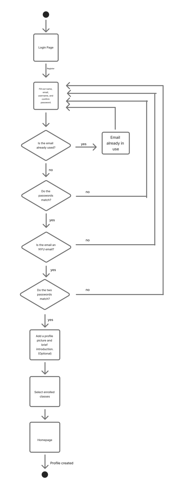
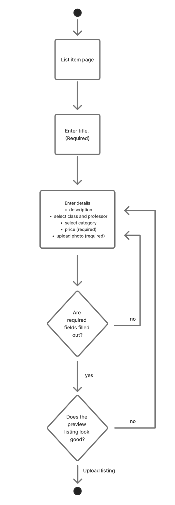

# NYU Resells - Specification Phase Exercise
An app for the NYU community that allows students to purchase and resell used textbooks from NYU classes.

## Team members

- [Jubilee Tang](https://github.com/MajesticSeagull26)
- [Susan Wang](https://github.com/sw5556)
- [Vaishnavi Suresh](https://github.com/vaishnavi-suresh)
- [Catherine Yu](https://github.com/catherineyu2014)

## Stakeholders

### Stakeholder #1: Colin Chau (Junior at NYU)
I once sold my used textbooks at the NYU Bookstore and got only $4 for 3 books. I wanted to sell used textbooks because I wanted a way to get rid of books that I no longer need, but also be able to make some of the money back from purchasing them at retail pricing. I found it ridiculous that I was only able to get $4 back, and would love to sell my books on a NYU student-run app. This way, I can be assured that my textbooks will go to another student taking the same class, and I can have a say in the pricing of them too. 

### Stakeholder #2: Kaitlyn Chau (Recent NYU Graduate)
I had to buy a textbook through Facebook marketplace once, and I wish there was an app to facilitate course material selling in just the NYU community. I usually opt for finding free versions of textbooks online or buying it second hand, but it is usually hard to find. I feel like an app that is only for the NYU community means that transactions are a lot safer, and the chances that I will find a book that I need is higher. I would also be interested in posting listings of my old textbooks so they don’t take up space in my apartment. 

### Conclusion
Based on our interviews, here are some problems and goals we can identify from our stakeholders:  

**Problems:**
1. The NYU Bookstore is one of the few places that provides a buyback option for used textbooks, but the compensation is much lower than the original purchase price
2. General reselling platforms are accessible to anyone, which increases the risk of scams and unsafe transactions for students.
3. Other reselling platforms are not marketplaces dedicated to textbooks, which makes it hard for students to find specific books they are required to have for class. 
4. Without a dedicated platform for reselling textbooks, it is difficult for students to find textbooks at an affordable price, forcing them to either pay for the textbook at full price or spend a lot of time browsing on different platforms.  

**Goals:**
1. Having a platform that is exclusive to NYU students, so that textbook transactions can happen safely within the community.
2. Having a platform that is exclusive to the NYU campus, so transactions and meet ups can be easily coordinated on campus. 
3. Being able to negotiate the price of textbooks that they are reselling/purchasing.
4. To provide a marketplace where students can easily find the class materials they need, without searching across multiple platforms or paying high prices.
5. Foster a community environment where textbooks can be reused efficiently, reducing waste and costs for students.

## Product Vision Statement
Our app provides a secure marketplace exclusively for NYU students to buy, sell, or give away textbooks, making it easier to find course materials by class and professor while ensuring safer, community-based exchanges.

## User Requirements
1. As a user, I want to create a profile so that I can participate in buying, selling, and rating safely.
2. As a user, I want to make sure that everyone in the app is a verified NYU student so that I can feel safer on the platform and be able to find closely related products.
3. As a user, I want to be able to change my profile so that I can present myself authentically and safely on the platform.
4. As a seller, I want to post an item with details such as category, course number, and professor so that potential buyers can find what they need.
5. As a user, I want to specify my pick-up/drop-off location so we can easily coordinate meet-ups for transactions.
6. As a buyer, I want to search for textbooks by course number and professor so that I can quickly find relevant materials.
7. As a buyer, I want to filter search results by item category, price, or condition so I can find the best match for my needs.
8. As a user, I want to rate each transaction so that I can provide feedback on each purchase to inform others.
9. As a buyer, I want to see the rating summary of each seller’s profile so I can evaluate the trustworthiness of the seller.
10. As a seller, I want to upload pictures of my textbooks so buyers can see what condition the course materials are.
11. As a seller, I want to be able to add descriptions of the course material so that I can provide more details for potential buyers.
12. As a buyer, I want to be able to add items to my wishlist so that I can keep track of the products that I’m interested in.
13. As a buyer, I want to be able to see my transaction history in my profile so that I can keep track of what I bought and who I bought it from.
14. As a seller, I want to show the prices of my products so that potential buyers are aware of how much I am expecting.
15. As a buyer, I want to be able to place a bid on a listing so that I can negotiate the price of the listing.
16. As a seller, I want to be able to place a counter bid so I can re-negotiate the price of the listing with the buyer. 
17. As a user, I want to message other users within the app to negotiate or ask questions about an item.
18. As a user, I want to receive notifications when someone messages me so I can connect with potential buyers/sellers as fast as possible. 
19. As a user, I want to receive notifications for new items that match my search criteria/wishlist so I can get product recommendations without having to actively search. 
20. As a user, I want to report inappropriate or suspicious listings or users to maintain community safety.

## Activity Diagrams
### 1. (User story #1) As a user, I want to create a profile so that I can participate in buying, selling, and rating safely: 

### 2. (User story #4) As a seller, I want to post an item with details such as category, course number, and price so that potential buyers can find what they need.

## Clickable Prototype

[Click here for our Figma prototype](https://www.figma.com/design/Ps4NHAgrH6dZ0qI6uOreG2/Clickable-Prototype?node-id=0-1&p=f&t=LUDqfgKx3hKIpyvQ-0)